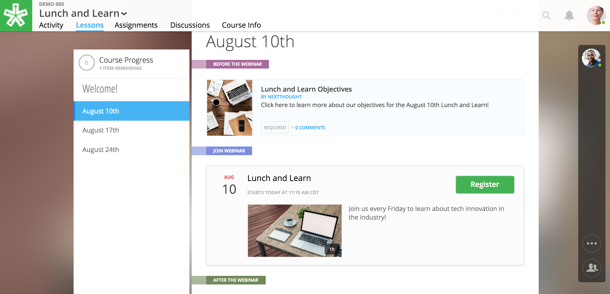
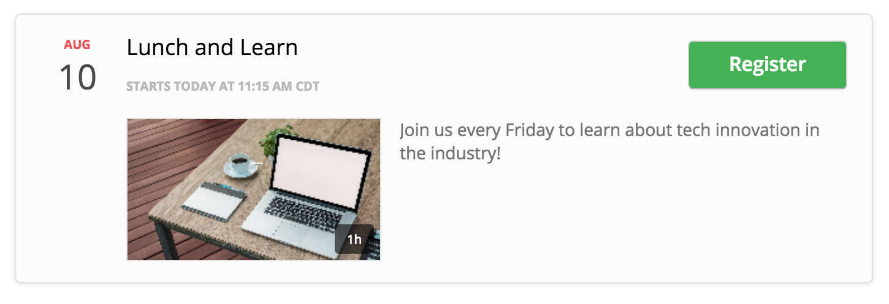
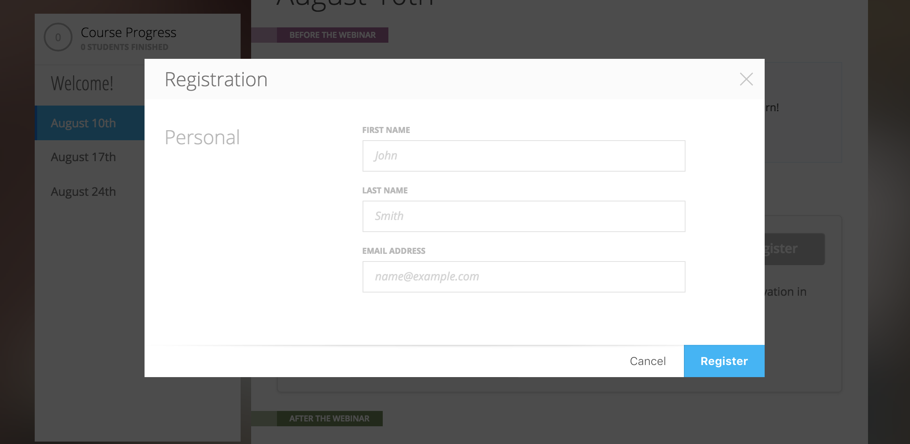
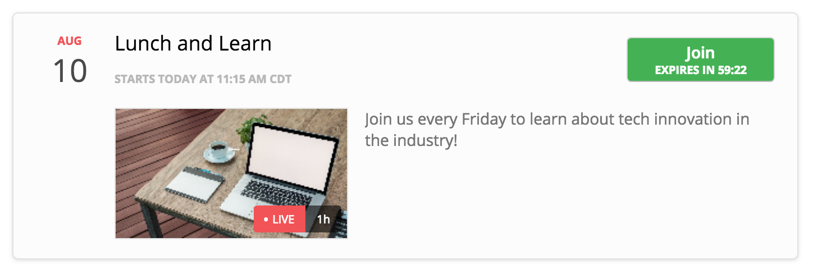

=============
Webinars
=============

NextThought integrates with GoToWebinar to allow you to register and launch webinars from inside your course! Some of your courses may include webinars.

Before you can join a webinar, you must first register to join.

When registering for a webinar, you will be prompted to provide your registration information.

The button that previously said “Register” will now say “Join” but will not be active until the organizer has launched the webinar. Be sure to check back soon and join the webinar before it begins!

.. image:: images/learnerjoininactive.png

Selecting “Join” will launch the webinar. When a webinar is already in session, a timer will appear on the “Join” button displaying how long is left in the webinar.

